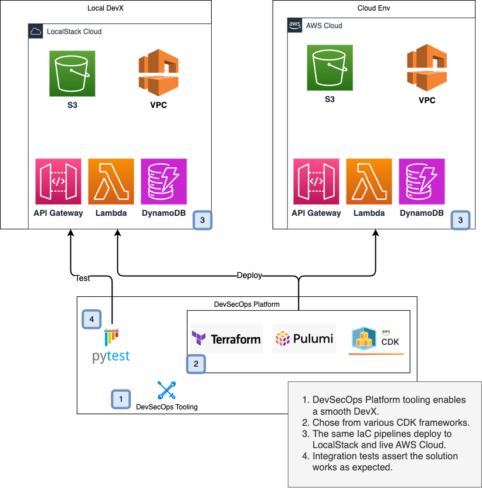
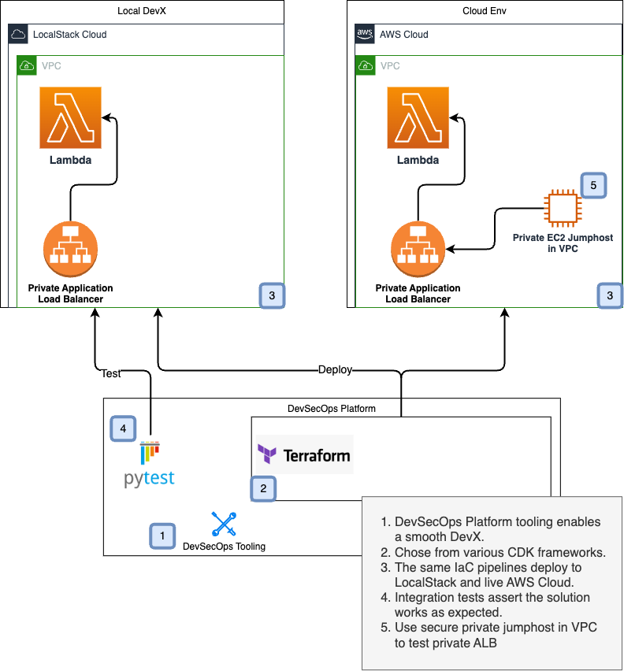
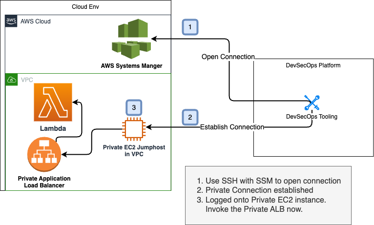

# Multi-IaC Pipeline Solution

Example with multiple IaC pipelines to setup a basic AWS solution with Terraform CDK, AWS CDK, and Pulumi.
The purpose of this sample is to

1. Demonstrate a standard directory layout for IaC, src code
2. Demonstrate DevOps environment configuration that supports CI pipelines that deploy to LocalStack and AWS
3. Demonstrate DevOps tooling with multiple flavors of IaC
4. Demonstrate integration tests running against solutions deployed to LocalStack
5. Demonstrate Typescript Lambda Hot Reloading in LocalStack

## Multi-IaC DevOps APIGW Lambda Solution

Features deploying an HTTP API Gateway, Lambda, as well as S3 and other resources.



## Multi-IaC DevOps Private Application Load Balancer to Lambda Solution

Features deploying a VPC, Private Application Load Balancer (ALB), and Lambda.



## Cloudfront S3 React UI Solution with Jest Test

Features deploying a Cloudfront distribution, S3 bucket, and a React web app.
Checkout the test [here](./auto_tests/jest/cloudfront.test.ts).
The Terraform pipeline is [here](./iac/terraform/hcl/react-ui/main.tf).


## Private Jumphost on Private VPC Subnet Solution

Features using private jumphost in private VPC for secure access to protected resources.
This jumphost does not have a public IP and does not allow any inbound network traffic.



## Cloud Infrastructure, Platform, Solution Layers

AWS Customers build cloud-based solutions in layers 3-5. DevOps CI pipelines can also be broken down separately
along layer boundaries. The [Terraform CDK main.ts](./iac/terraform/cdk/main.ts) file has App solution pipelines
at layer 5 and account level VPC configuration pipelines at level 3.


# Deploying the App to LocalStack

To deploy your infrastructure, follow the steps below.

### Prerequisites

1. [Install unzip](https://www.tecmint.com/install-zip-and-unzip-in-linux/)

2. [Install LATEST AWS CLI](https://docs.aws.amazon.com/cli/latest/userguide/getting-started-install.html)

3. [Install Terraform](https://developer.hashicorp.com/terraform/tutorials/aws-get-started/install-cli)

4. [Install JQ](https://jqlang.github.io/jq/download/)

5. [Install Docker](https://docs.docker.com/engine/install/)

6. [Install Node Version Manager (NVM)](https://github.com/nvm-sh/nvm#installing-and-updating)

7. Select Node version 18

```shell
nvm install 18
```

8. Install Terraform CDK
   Install cdktf in the node 18 version you just installed in step (4).

```shell
npm install --global cdktf-cli@^0.18.0
```

9. Install `make`, `gcc`, `g++`, etc. For MacOS, run `brew install make gcc openssl readline sqlite3 xz` and for Ubuntu
   machines
   run `apt install build-essential libbz2-dev libssl-dev libreadline-dev libffi-dev zlib1g-dev libsqlite3-dev liblzma-dev`.

10. Install `zlib1g-dev`. For MacOS, run `xcode-select --install` and for Ubuntu machines run `apt install zlib1g-dev`.

11. [Install Pyenv](https://github.com/pyenv/pyenv#installation). Make sure
    the [prerequisites](https://github.com/pyenv/pyenv/wiki/Common-build-problems#prerequisites) are also there.

### Steps

From the working directory:

1. Set your LocalStack pro key. Add this line of code to a file named `.env-gdc-local` at the root of this project. Set
   your actual LocalStack key.

      ```bash
      export LOCALSTACK_AUTH_TOKEN=<your auth token>
      ```

2. Start LocalStack.

      ```bash
      make start-localstack
      ```


3. Setup an AWS_PROFILE for LocalStack.

#### Add this to your `~/.aws/config` file

```text
[profile localstack]
region=us-east-1
output=json
endpoint_url = http://localhost:4566
```

#### Add this to your `~/.aws/credentials` file

```text
[localstack]
aws_access_key_id=test
aws_secret_access_key=test
```

4. Setup the virtual Python environment.

```sh
pyenv install 3.11 && \
   pyenv local 3.11 && \
   python -m venv .venv && \
   . .venv/bin/activate && \
   pip install -r devops-tooling/requirements.txt
```

# IaC Pipelines

## Terraform CDK Instructions

[Solution Guide for Terraform CDK](./docs/README-cdktf.md "Solution Guide for TerraformCDK")

## AWS CDK

[Solution Guide for AWS CDK](./docs/README-awscdk.md "Solution Guide for AWS CDK")

## Pulumi Instructions (Work in Progress)

[Solution Guide for Pulumi](./docs/README-pulumi.md "Solution Guide for Pulumi")

# Tests

First export the following env vars:

```bash
export LOCALSTACK_AUTH_TOKEN=<auth-token>
export DOCKER_COMPOSE_FLAGS="--build"
export BUILDKIT_PROGRESS=plain
```

And then run the AWS CDK and the Terraform-based AWS CDK deployments:

```
export CI_TEST_NAME=awscdk make run-ci-test
export CI_TEST_NAME=awscdktf make run-ci-test
```

***Note: If you run the above tests with Rosetta turned on, and still want to go with `arm64`, you need to
export `export OVERRIDE_LOCAL_ARCH=arm64`.***

# Hot Reloading!

The Lambda is setup for hot reloading in this project on LocalStack by default. After everything is deployed by
following one of complete
IaC deployments above, you can work with the Lambda in hot-reload mode.
See [LocalStack Hot Reloading](https://docs.localstack.cloud/user-guide/tools/lambda-tools/hot-reloading)

Now, your DevX looks like a rapid TDD cycle. There's a test in `auto_tests/test_apigw_name.py`.
Run watch to do a build whenever code changes in the Lambda.

```shell
make watch-lambda
```
